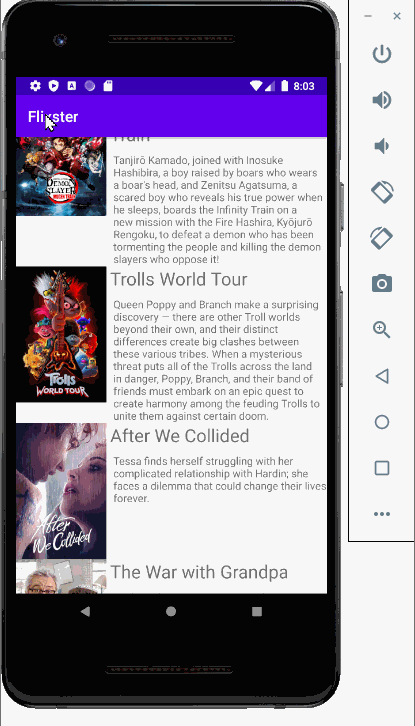

<h1 align="center">Hi 👋, I'm Vanessa Hernandez, i love developing and data</h1>

<h3 align="left">Languages and Tools:</h3>

        

 

<h3 align="left">Some of my Projects:</h3>

<h3 align="left">Portfolio</h3>
CSS, HTML5 and Javascript was used to create an website that highlights my skills and projects

Website: 
https://vanessahern.netlify.app/

<h3 align="left">Project 1: Animal Shelter Website</h3>
CSS, HTML5 and Javascript was used to create an website that promotes donating to various Animal Shelters. It also has an embedde websites.

<h3 align="left">Project 2: Movie Android App</h3>
Created a movie android application using Java and JSON to display current movies playing at the theaters along with a summary.

